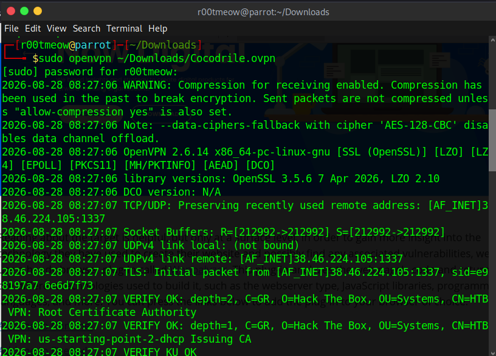
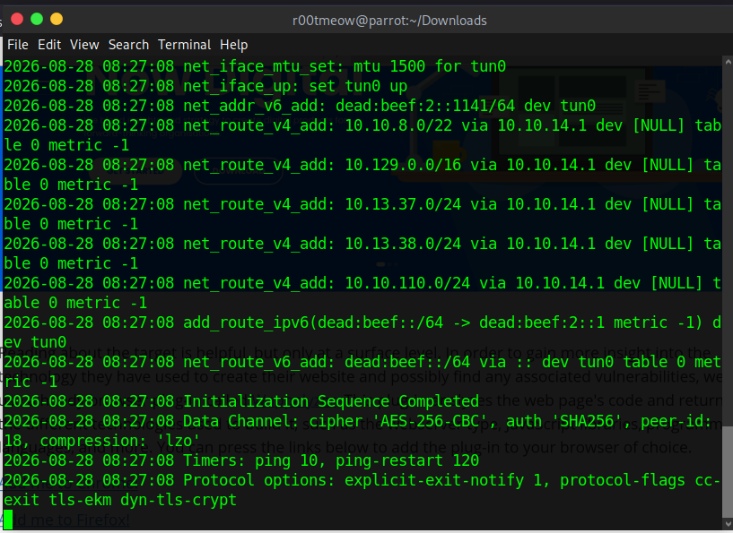
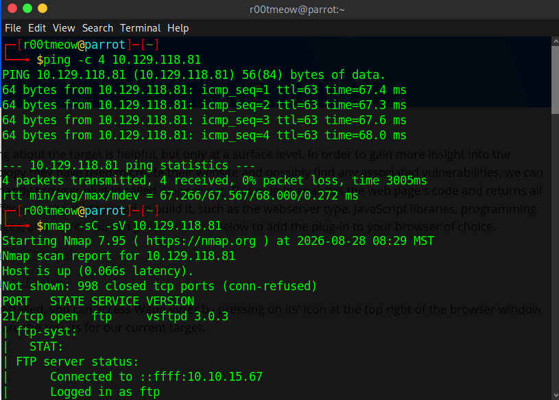
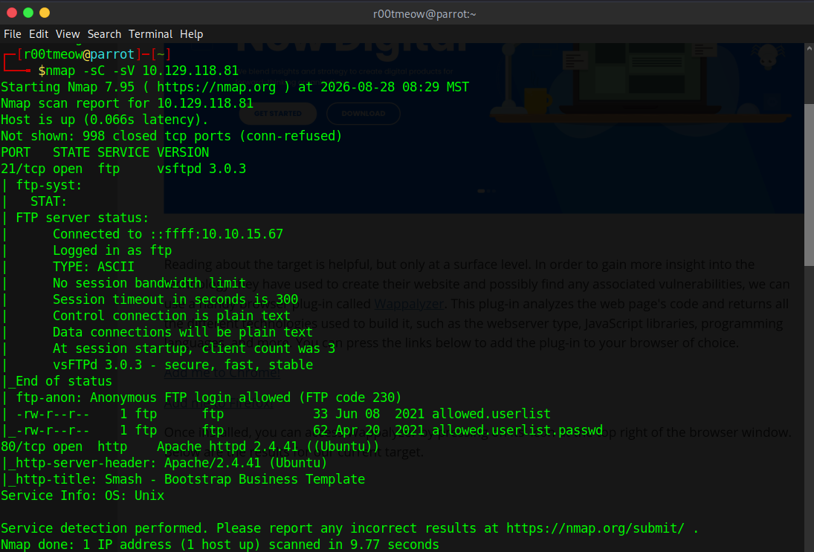
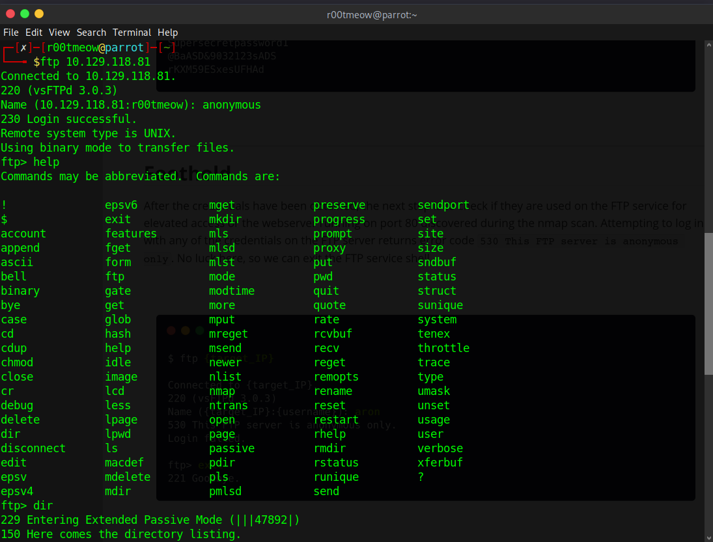
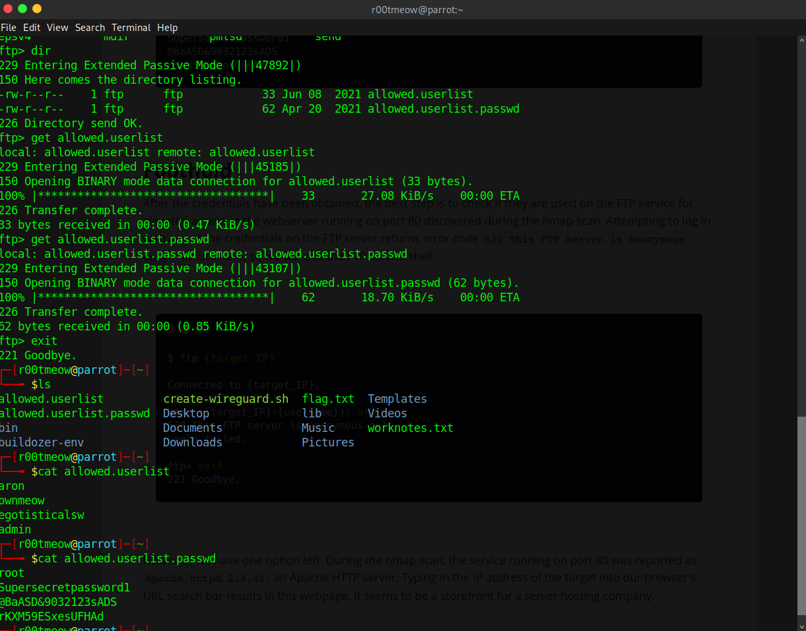
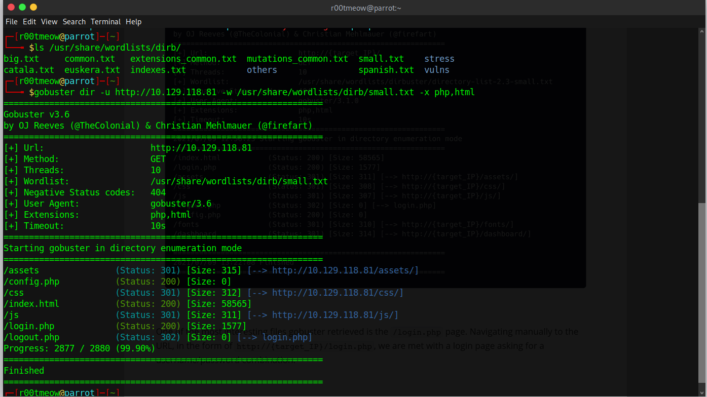
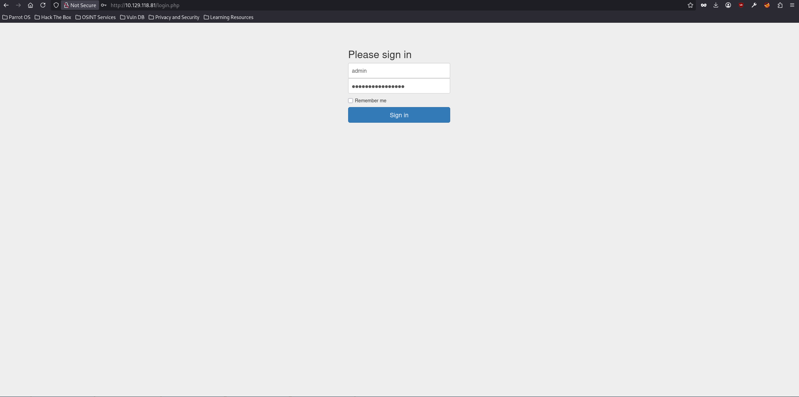
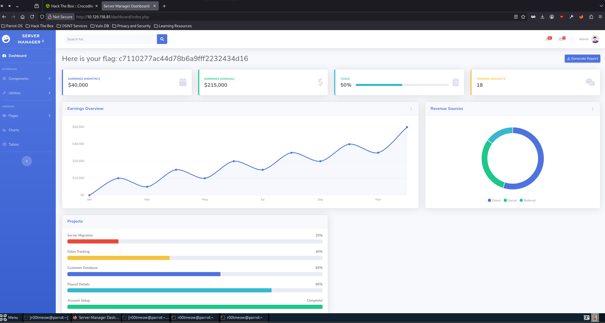

# Crocodile — HackTheBox Write-up

**Difficulty:** Easy
**OS:** Linux
**Date completed:** 28/08/2026

---

## Overview

Crocodile is an easy Linux machine that illustrates, quite directly, two misconfigurations that keep showing up in real environments: anonymous authentication enabled on a service that shouldn't allow it, and plaintext credentials exposed in files reachable without authentication. The FTP server accepts anonymous login and, once enumerated, exposes two files that together form a list of usernames and passwords. On the web side, directory brute-forcing reveals a login panel that isn't linked anywhere on the visible site, and the credentials pulled from FTP turn out to be valid for logging into it as an administrator.

## Recon

### Environment Setup

Connected to the HTB VPN network before starting enumeration.




### Connectivity check

Before firing up nmap, I confirm the host is up and note the latency (useful later as a baseline if something feels slow):

```
ping -c 4 10.129.118.81

PING 10.129.118.81 (10.129.118.81) 56(84) bytes of data.
64 bytes from 10.129.118.81: icmp_seq=1 ttl=63 time=67.4 ms
64 bytes from 10.129.118.81: icmp_seq=2 ttl=63 time=67.3 ms
64 bytes from 10.129.118.81: icmp_seq=3 ttl=63 time=67.6 ms
64 bytes from 10.129.118.81: icmp_seq=4 ttl=63 time=68.0 ms

--- 10.129.118.81 ping statistics ---
4 packets transmitted, 4 received, 0% packet loss, time 3005ms
```


### Nmap

```
nmap -sC -sV 10.129.118.81

PORT   STATE SERVICE VERSION
21/tcp open  ftp     vsftpd 3.0.3
| ftp-syst:
|   STAT:
| FTP server status:
|      Connected to ::ffff:10.10.15.67
|      Logged in as ftp
|      TYPE: ASCII
|      No session bandwidth limit
|      Session timeout in seconds is 300
|      Control connection is plain text
|      Data connections will be plain text
|      At session startup, client count was 3
|      vsFTPd 3.0.3 - secure, fast, stable
|_End of status
| ftp-anon: Anonymous FTP login allowed (FTP code 230)
| -rw-r--r--    1 ftp      ftp            33 Jun 08  2021 allowed.userlist
|_-rw-r--r--    1 ftp      ftp            62 Apr 20  2021 allowed.userlist.passwd
80/tcp open  http    Apache httpd 2.4.41 ((Ubuntu))
|_http-server-header: Apache/2.4.41 (Ubuntu)
|_http-title: Smash - Bootstrap Business Template
Service Info: OS: Unix
```



Two things stand out right away:

- Nmap's `ftp-anon` script already confirms anonymous login is allowed, and lists two files sitting in the FTP root: `allowed.userlist` and `allowed.userlist.passwd`. The names alone are pretty suggestive.
- Port 80 is running Apache on top of a Bootstrap template ("Smash - Bootstrap Business Template"), which points to a fairly generic site — the kind where it's worth fuzzing for paths that aren't linked from the homepage.

### Enumeration

#### FTP - Port 21

I confirm the anonymous login manually and pull down the two files nmap had already flagged:

```
ftp 10.129.118.81
Connected to 10.129.118.81.
220 (vsFTPd 3.0.3)
Name (10.129.118.81:r00tmeow): anonymous
230 Login successful.

ftp> dir
-rw-r--r--    1 ftp      ftp            33 Jun 08  2021 allowed.userlist
-rw-r--r--    1 ftp      ftp            62 Apr 20  2021 allowed.userlist.passwd

ftp> get allowed.userlist
ftp> get allowed.userlist.passwd
ftp> exit
```




Checking the contents of both files:

```
$ cat allowed.userlist
aron
pwnmeow
egotisticalsw
admin

$ cat allowed.userlist.passwd
root
Supersecretpassword1
@BaASD&9032123sADS
rKXM59ESxesUFHAd
```

Both files have the same number of lines (4), which strongly suggests they're meant to be read in parallel: line *n* of `allowed.userlist` maps to line *n* of `allowed.userlist.passwd`. Under that reading, the `admin` user (last line of the first file) would have `rKXM59ESxesUFHAd` (last line of the second) as its password. That's a reasonable inference from the ordering of the files, not something the FTP server confirms outright — but it turned out to be the correct credential, as shown below.

#### HTTP - Port 80

The homepage (`index.html`) is the Bootstrap template nmap already hinted at, with no visible login. I run gobuster to look for unlinked paths and files:

```
gobuster dir -u http://10.129.118.81 -w /usr/share/wordlists/dirb/small.txt -x php,html

/assets               (Status: 301) [Size: 315] [--> http://10.129.118.81/assets/]
/config.php           (Status: 200) [Size: 0]
/css                  (Status: 301) [Size: 312] [--> http://10.129.118.81/css/]
/index.html           (Status: 200) [Size: 58565]
/js                   (Status: 301) [Size: 311] [--> http://10.129.118.81/js/]
/login.php            (Status: 200) [Size: 1577]
/logout.php           (Status: 302) [Size: 0] [--> login.php]
```



`login.php` is the key find: an authentication endpoint that isn't linked from anywhere on the public site, and one that would have gone completely unnoticed without directory fuzzing.

## Foothold

With the username/password pair pulled from FTP (`admin` / `rKXM59ESxesUFHAd`), I try logging in at `/login.php`. The credentials are valid and I get access to the admin panel.




The vulnerability chain was straightforward: anonymous FTP access exposed plaintext username/password files, one of which provided valid administrator credentials for the web application. These credentials granted access to the unlinked login panel, which then exposed the flag on the administrator dashboard.

Once authenticated, `login.php` redirects to `/dashboard/index.php`, where the flag is exposed directly — no further privilege escalation or shell access needed. The full vulnerability chain (leaked credentials → unprotected panel) is enough to compromise the target's objective end to end.

## Flag

The flag is obtained directly on the admin dashboard right after login, with no additional post-exploitation steps:

```
http://10.129.118.81/dashboard/index.php
```

## Vulnerabilities Summary

| Category | Vulnerability | Why It Mattered |
|---|---|---|
| Configuration | Anonymous authentication enabled on vsFTPd 3.0.3 | Allowed unauthenticated access to files on the FTP server |
| Sensitive Data Exposure | Plaintext credentials (`allowed.userlist` / `allowed.userlist.passwd`) | Exposed valid username/password pairs for the web panel |

## Lessons Learned / Takeaways

- The combination of two "minor" findings (anonymous FTP + suggestively named files) is what makes the difference here. Neither one is critical on its own, but together they hand over admin access.
- It's worth treating nmap's `ftp-anon` result as a signal to *always* list the contents manually, even when nmap already shows the filenames — you still need to pull them down and read them.
- Directory fuzzing is still essential even on sites that look, at first glance, like "just a static template." An unlinked login panel isn't real protection, it's just a lack of visibility.
- A good reminder that not every easy box needs post-exploitation: here the full chain (leaked FTP credentials → unprotected login → flag on the dashboard) was already enough to compromise the objective, no shell or privilege escalation required.

## References

- [Gobuster](https://github.com/OJ/gobuster) — directory/file brute-forcing tool
- [Nmap `ftp-anon` NSE script](https://nmap.org/nsedoc/scripts/ftp-anon.html)
- [OWASP: Broken Access Control](https://owasp.org/Top10/A01_2021-Broken_Access_Control/)
- [HackTheBox — Crocodile](https://app.hackthebox.com/machines/Crocodile)
