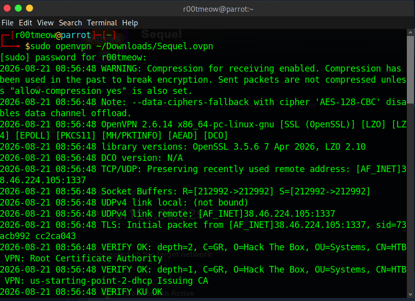
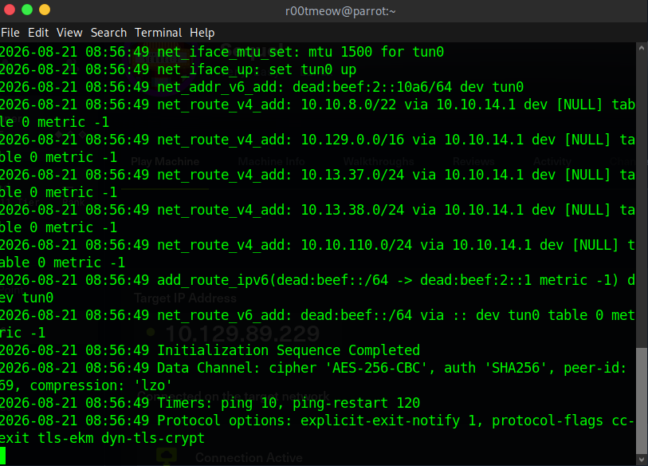
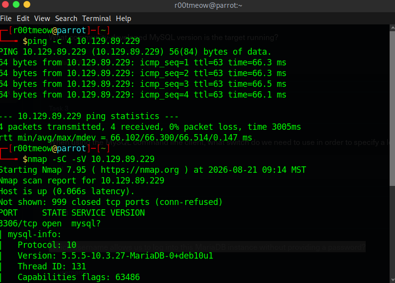
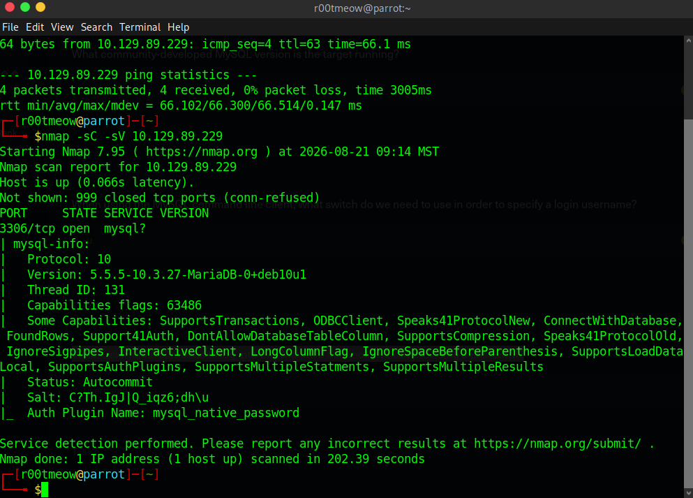
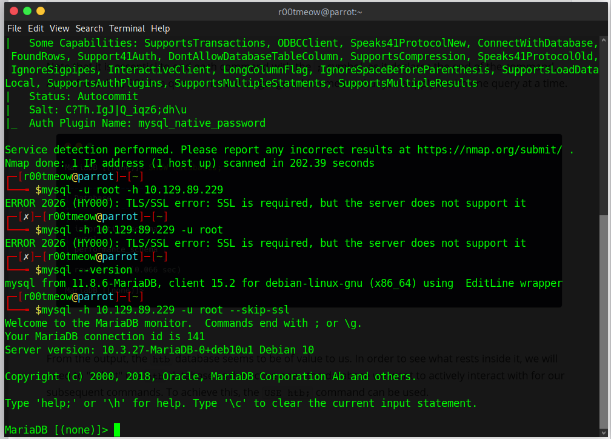
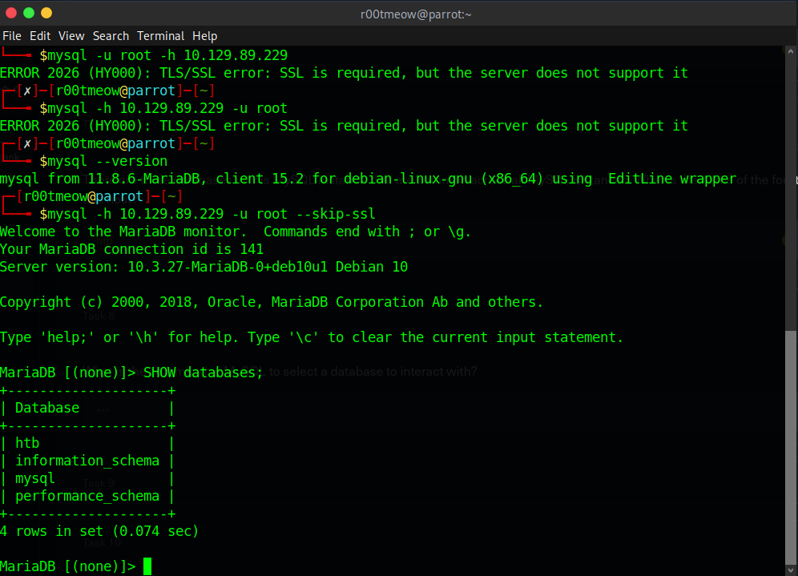
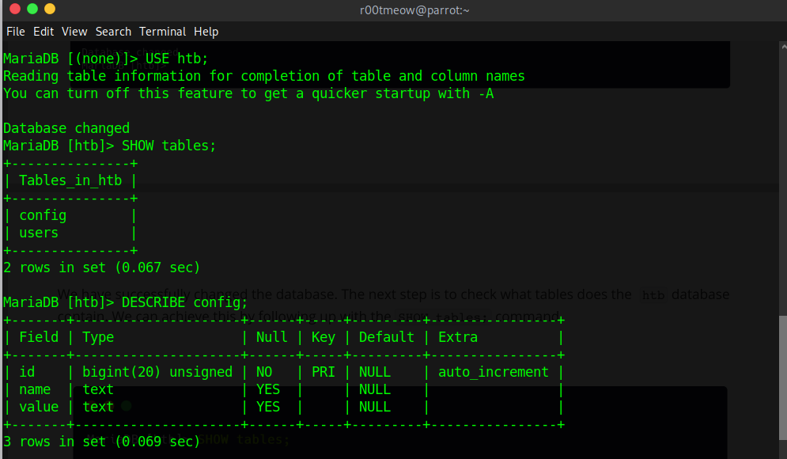
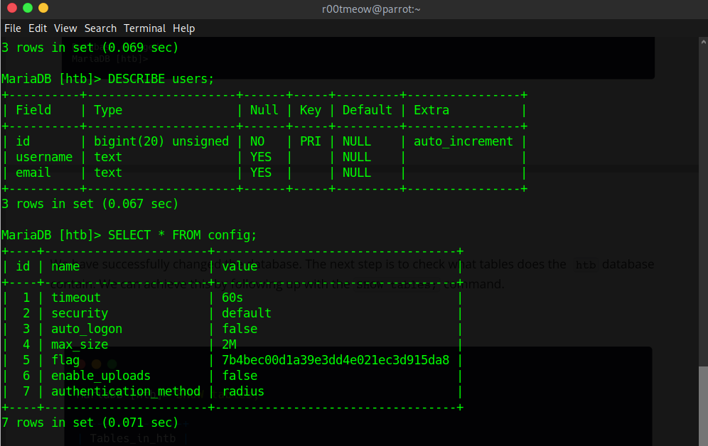
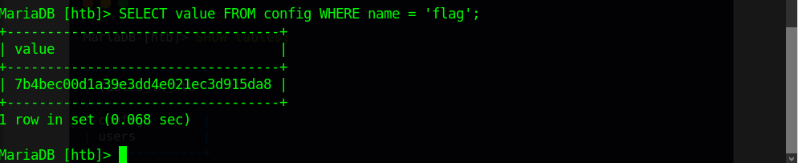

# Sequel — HackTheBox Write-up

**Difficulty:** Easy
**OS:** Linux
**Date completed:** August 21, 2026

---

## Overview

Sequel is a easy Linux machine that introduces a MySQL/MariaDB service misconfigured to allow the `root` database user to authenticate without a password. The machine is a straightforward exercise in database enumeration: connecting to the service, listing databases and tables, and querying them directly to extract sensitive data — no exploit code required, just knowing where to look.

## Recon

### Environment Setup

Connected to the HTB VPN network before starting enumeration.




### Connectivity check and Nmap

```
ping -c 4 10.129.89.229
```

Confirmed the host was up and reachable before scanning.



```
nmap -sC -sV 10.129.89.229
```

```
PORT     STATE SERVICE VERSION
3306/tcp open  mysql?
| mysql-info:
|   Protocol: 10
|   Version: 5.5.5-10.3.27-MariaDB-0+deb10u1
|   Thread ID: 131
|   Capabilities flags: 63486
|   Status: Autocommit
|   Salt: C?Th.IgJ|Q_iqz6;dh\u
|_  Auth Plugin Name: mysql_native_password
```



Only one port open: 3306/tcp, running MariaDB 10.3.27 (a community-developed fork of MySQL). No web service, no other attack surface — the database itself was the target.

### Enumeration — MySQL/MariaDB, Port 3306

First connection attempt failed because the client defaulted to requiring TLS, which the server doesn't support:

```
mysql -u root -h 10.129.89.229
ERROR 2026 (HY000): TLS/SSL error: SSL is required, but the server does not support it
```

Adding `--skip-ssl` resolved it, and the server accepted `root` with **no password at all**:

```
mysql -h 10.129.89.229 -u root --skip-ssl
```



## Foothold

The "foothold" here wasn't code execution — it was direct database access, granted by a misconfiguration: the root MySQL user allowed passwordless authentication, while the client required SSL by default even though the server did not support it. Using --skip-ssl allowed the connection to proceed.

```sql
SHOW databases;
```



Four databases were listed — three are standard on any MySQL/MariaDB install (`information_schema`, `mysql`, `performance_schema`), and one, **`htb`**, was unique to this host and clearly the target.

```sql
USE htb;
SHOW tables;
DESCRIBE config;
DESCRIBE users;
```



The `htb` database had two tables, `config` and `users`. Describing `config` showed a `name`/`value` structure — the kind of table that typically stores application settings, and a good candidate for anything interesting left behind.

```sql
SELECT * FROM config;
```



Dumping the full table showed a row named `flag` sitting right alongside ordinary settings like `timeout` and `max_size` — misplaced sensitive data in a config table, plain and simple.

## Privilege Escalation

Not applicable. No shell was obtained or needed — the objective was completed entirely through direct, unauthenticated database access and standard SQL queries.

## Flag

```sql
SELECT value FROM config WHERE name = 'flag';
```



**Flag:** `7b4bec00d1a39e3dd4e021ec3d915da8`

## Vulnerabilities Summary

| Category | Vulnerability | Why It Mattered |
|---|---|---|
| Configuration | `root` MySQL/MariaDB user with no password set | Allowed passwordless authentication as the root database user, providing full-privilege database access |
| Data handling | Sensitive value (`flag`) stored in a general-purpose `config` table | Anyone who reaches the database at all immediately finds it — no separation between settings and secrets |

## Lessons Learned / Takeaways

- Reinforced that not every foothold needs an exploit — a misconfigured authentication requirement, such as passwordless access to a privileged database account, can be just as effective as a technical vulnerability.
- Practiced core SQL enumeration commands (`SHOW databases`, `USE`, `SHOW tables`, `DESCRIBE`, `SELECT`) as a repeatable checklist for any exposed database service.
- Reinforced why database accounts — especially `root`/admin-level ones — should never be left without a password, regardless of network exposure assumptions.
- Reinforced why secrets and configuration values should never share a table with ordinary application settings.

## References

- [Hack The Box — Sequel](https://app.hackthebox.com/machines/Sequel)
- [MariaDB Documentation — Authentication and Access Control](https://mariadb.com/kb/en/authentication-from-mariadb-10-4/)
